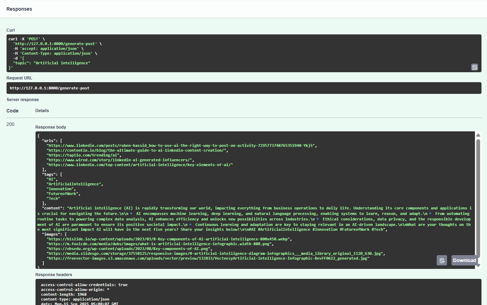

###  **Installation and Startup**
---
1. Clone the repository<br>
2. Create a .env file and add the variables and their respective values as mentioned below:
-  ` TAVILY_API_KEY = "<API_KEY_VALUE>" ` for search tool - API key can created by following [link](https://app.tavily.com/home).
-  ` GOOGLE_API_KEY = "<API_KEY_VALUE" ` for Gemini LLM model - API key can be created by following [link](https://console.cloud.google.com/welcome?project=gold-rock-450306-s4).<br>

3. Install the dependencies using : `pip install -r requirements.txt`<br>
4. Start the server using the following command:<br>
 ```bash
    fastapi dev main.py  
  ```
5. Server running at http://127.0.0.1:8000 (Open it in the browser)
6. To test the request and response of the sever  use `/docs` after the port number
    ```bash
       http://127.0.0.1:8000/docs
    ```
 - It convert the url into FastAPI - Swagger UI as below
   <br><br>
   <div style="text-align: center;">
    
   </div>
   <br><br>
- In that Swagger URL all the REST API used in the file is displayed.
- Click `POST/generate-post`. On that there is but `Try it out ` click and enter the topic you want to search ,then click evaluate 
<br><br>
   <div style="text-align: center;">
    
   </div>
   <br><br>
  - The respose will will displayed in the response cell with ` Response code 200 ` 
  <br><br>
   <div style="text-align: center;">
    
   </div>
   <br><br>
   


